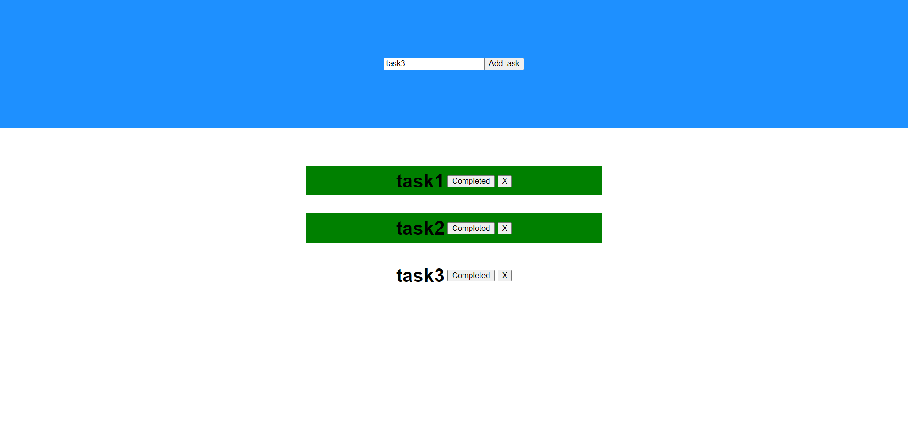
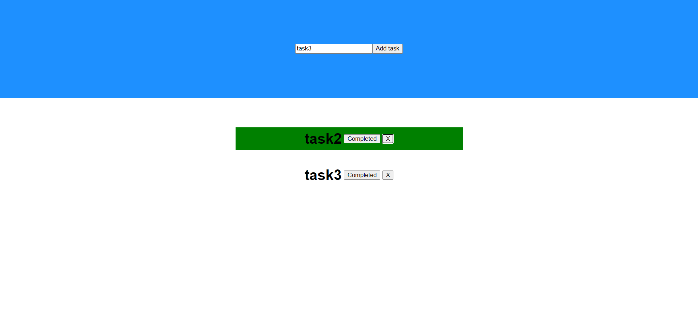

# React Notes

React is a popular open-source JavaScript library used for building user interfaces. It was created by Facebook and is now maintained by Facebook and a community of developers.

## Table of Contents

- [Why React over vanilla JS?](#why-react-over-vanilla-js)
- [Setting up a React app](#setting-up-a-react-app)
- [Running the React app](#running-the-react-app)
- [JSX](#jsx)
  - [Why JSX?](#why-jsx)
- [Components](#components)
  - [Using a component](#using-a-component)
- [Props](#props)
- [CSS in React](#css-in-react)
  - [With App.css](#with-appcss)
  - [With App.module.css](#with-appmodulecss)
  - [Inline CSS](#inline-css)
- [Conditional Rendering](#conditional-rendering)
- [Lists in React](#lists-in-react)
- [Lists and components](#lists-and-components)
- [State](#state)
  - [Use case of State](#use-case-of-state)
    - [Show and hide a div on the click of a button](#show-and-hide-a-div-on-the-click-of-a-button)
- [CRUD Operations in React](#crud-operations-in-react)
- [Component Lifecycle](#component-lifecycle)
- [useEffect Hook](#useeffect-hook)
- [React Strict mode](#react-strict-mode)
- [How To Fetch Data From an API](#how-to-fetch-data-from-an-api)
- [React Router DOM](#react-router-dom)
  - [React Router DOM v6](#react-router-dom-v6)
  - [React Router DOM v6.4+](#react-router-dom-v64)
  - [Data Fetching](#data-fetching)
- [State Managment - useContext Hook](#state-managment---usecontext-hook)
- [React query - to fetch data from APIs](#react-query---to-fetch-data-from-apis)
  - [Why react query?](#why-react-query)
  - [Setting up the project](#setting-up-the-project)

## Why React over vanilla JS?

- Makes it easy to create complex and dynamic UIs by breaking them down into reusable components.

- Provides a virtual DOM (Document Object Model) which enables efficient updating of the UI by only re-rendering the parts that have changed, rather than the whole page.

- Performance

- Simplicity

## Setting up a React app

```bash
npx create-react-app my-app
```

## Running the React app

```
npm start
```

Opens on `localhost:3000`

## JSX

JSX = JS + HTML

```javascript
const jsx = <h1>This is JSX</h1>;
```

### Why JSX?

- Easier insertion of HTML code in JS
- Code reusability
- Code organisation

## Components

A JS function that returns JSX.

```javascript
// A component
const GetNameComponent = () => {
  return <h1>MARTIALEAGLE</h1>;
};
```

- Has to start with Capital
- App component is the first component to be displayed in the website.

### Using a component

```javascript
function App() {
  return (
    <div className="App">
      <GetNameComponent />
    </div>
  );
}
```

## Props

An object that acts as Argument / Parameter for components.

```javascript
function App() {
  return (
    <div className="App">
      <User name="ash" age={20} email="ash@ash.com" />
      <User name="bash" age={20} email="bash@ash.com" />
      <User name="cash" age={20} email="cash@ash.com" />
    </div>
  );
}

const User = (props) => {
  return (
    <div>
      <h1>{props.name}</h1>
      <h2>{props.age}</h2>
      <h2>{props.email}</h2>
    </div>
  );
};
```

props object looks like this:

```javascript
props = {
  name: "ash",
  age: 20,
  email: "ash@ash.com",
};
```

## CSS in React

### With App.css

Adding css in the `App.css` file and importing it into the `App.js` file is one way of doing it.

### With App.module.css

Using `App.module.css` turns the css file into a Css module style sheet.

Import it into the `App.js` file.

```javascript
import styles from "./App.module.css";
```

And treat it as objects and use css in class names.

```javascript
function App() {
  return (
    <div className={styles.App}>
      <h1 className={styles.name}>MARTIALEAGLE</h1>
    </div>
  );
}
```

### Inline Css

Add styling to the JSX elements where they are written.

```javascript
function App() {
  return (
    <div className={styles.App}>
      <h1 className={styles.name} style={{ color: "brown" }}>
        MARTIALEAGLE
      </h1>
    </div>
  );
}
```

## Conditional Rendering

Uses the ternary operator(**?**).

```javascript
{
  age > 18 ? <h1>OVER AGE</h1> : <h1>UNDER AGE</h1>;
}
```

**&&** - used as a if statement

```javascript
{
  isGreen && <button>This is a button</button>;
}
```

## Lists in React

```javascript
function App() {
  const names = ["Pedro", "Jake", "Mike", "Jack", "Kyle"];

  return (
    <div className="App">
      {names.map((name, key) => {
        return (
          <h1 className="name" key={key}>
            {name}
          </h1>
        );
      })}
    </div>
  );
}
```

- necessary to use the `key` property, else it will show warning.

## Lists and components

`App.js`

```javascript
import "./App.css";
import { User } from "./User.js";

function App() {
  const users = [
    { name: "Pedro", age: 21 },
    { name: "Jake", age: 25 },
    { name: "Jessica", age: 45 },
  ];

  return (
    <div className="App">
      {users.map((user, key) => {
        return <User name={user.name} age={user.age} />;
      })}
    </div>
  );
}

export default App;
```

We create a new file in the name of the component and export the component to the main file.

`User.js`

```javascript
export const User = (props) => {
  return (
    <div>
      {props.name} {props.age}
    </div>
  );
};
```

## State

```javascript
function App() {
  let age = 0;

  const updateAge = () => {
    age += 1;
    console.log(age);
  };

  return (
    <div className="App">
      {age}
      <br />
      <button onClick={updateAge}>Increment</button>
    </div>
  );
}
```

No change is reflected in the website as React first renders once and displays the value of the variable at that time.

Hence we are going to use states.

- We use states using a hook called `useState`.
- First, we have to import it.

  ```javascript
  import { useState } from "react";
  ```

- Initialize with variable name, and a function used to update the variable and a value to set initally inside the `useState()`.

  ```javascript
  function App() {
    let [age, setAge] = useState(0); // Initializing a state

    const updateAge = () => {
      setAge(age++);
    };

    return (
      <div className="App">
        <h1>{age}</h1>
        <br />
        <button onClick={updateAge}>Increment</button>
      </div>
    );
  }
  ```

  ## Use case of State

  With an input value we can actively display as it is changed.

  ```javascript
  function App() {
    const [inputValue, setinputValue] = useState("");

    const handleInputchange = (event) => {
      setinputValue(event.target.value);
    };

    return (
      <div className="App">
        <input type="text" onChange={handleInputchange} />
        <h1>{inputValue}</h1>
      </div>
    );
  }
  ```

  ### Show and hide a div on the click of a button.

  ```javascript
  function App() {
    const [showText, setShowText] = useState(true);

    return (
      <div className="App">
        <button
          onClick={() => {
            setShowText(!showText);
          }}
        >
          Show/Hide
        </button>
        {showText && <h1>This is a secret text</h1>}
      </div>
    );
  }
  ```

## CRUD Operations in React

We'll be doing this by creating a to-do list.

Refer to the following [repository](https://github.com/AshwanthramKL/toDoList-react) for the code.




## Component Lifecycle

Lifecycle refers to the stages that a component goes through.

**3 Stages**:

- **Mounting** - The component appearing in the screen or starting to exist in the project.
- **Updating** - The component is changing something such as the UI, etc...
- **UnMounting** - The component stop appearing from the screen

## useEffect Hook

`useEffect` is a hook in React that allows you to perform side effects in functional components.

Side effects include tasks like fetching data from a server, modifying the DOM, or setting up event listeners.

```javascript
useEffect(() => {
  console.log("COMPONENT MOUNTED");
});
```

Console's log when the component is **mounted**.

```javascript
useEffect(() => {
  console.log("COMPONENT MOUNTED");

  return () => {
    console.log("COMPONENT UNMOUNTED");
  };
});
```

The console log inside the return statement will be executed when the component unmounts.

The `useEffect()` also take another parameter.

This parameter contains an array of dependencies that determines when the side effect should be executed.

```javascript
useEffect(() => {
  console.log("COMPONENT MOUNTED");

  return () => {
    console.log("COMPONENT UNMOUNTED");
  };
}, [text]);
```

In the above example the statement will be logged only if a change is made to the text variable.

## React Strict mode

`<StrictMode>` lets you find common bugs in your components early during development.

Use StrictMode to enable additional development behaviors and warnings for the component tree inside.

```javascript
import { StrictMode } from "react";
import { createRoot } from "react-dom/client";

const root = createRoot(document.getElementById("root"));
root.render(
  <StrictMode>
    <App />
  </StrictMode>
);
```

## How To Fetch Data From an API

Using `fetch`:

```javascript
fetch("https://catfact.ninja/fact")
  .then((res) => res.json())
  .then((data) => console.log(data));
```

Using `Axios`:

```javascript
Axios.get("https://catfact.ninja/fact").then((res) => {
  console.log(res.data);
});
```

## React Router DOM

### React Router DOM v6

```javascript
import { BrowserRouter as Router, Routes, Route } from "react-router-dom";
```

We first import the BrowserRouter, Routes, and Route component.

```javascript
<Router>
  <Routes>
    <Route path="/" element={<Home />} />
    <Route path="/menu" element={<Menu />} />
    <Route path="/contact" element={<Contact />} />
  </Routes>
</Router>
```

Then we set routes and elements to be displayed.

The file usually auto-imports the components fromt their locations.

```javascript
import { Home } from "./pages/Home";
import { Contact } from "./pages/Contact";
import { Menu } from "./pages/Menu";
```

Now we create an error page to show up if the route doesn't exist.

```javascript
<Route path="*" element={<h1>Error 404: Page not found</h1>} />
```

Creating a navbar component with `Link`

```javascript
import { Link } from "react-router-dom";

export const Navbar = () => {
  return (
    <div>
      <Link to={"/"}>Home</Link>
      <Link to={"/menu"}>Menu</Link>
      <Link to={"/contact"}>Contact</Link>
    </div>
  );
};
```

Place the component within Router and above Routes

```javascript
<Router>
  <Navbar />
  <Routes>
    <Route path="/" element={<Home />} />
    <Route path="/menu" element={<Menu />} />
    <Route path="/contact" element={<Contact />} />
    <Route path="*" element={<h1>Error 404: Page not found</h1>} />
  </Routes>
</Router>
```

Video Exercise: Watch this [video](https://www.youtube.com/watch?v=z0vaVoxMoSA) on Router DOM.

### React Router DOM v6.4+

Import the following components from the `react-router-dom` library.

```javascript
import {
  createBrowserRouter,
  createRoutesFromElements,
  Route,
  Link,
  Outlet,
  RouterProvider,
} from "react-router-dom";
```

Assign the `createBrowserRouter` to router variable.

Embed the `createRoutesFromElements` inside it.  
Inside it goes all the `Route` components.  
`index` means that route will load first.

```javascript
const router = createBrowserRouter(
  createRoutesFromElements(
    <Route path="/" element={<Root />}>
      <Route index element={<Home />} />
      <Route path="/data" element={<Data />} />
      <Route path="/contact" element={<Contact />} />
    </Route>
  )
);
```

Creat Root Component with `Link`.

```javascript
const Root = () => {
  return (
    <div>
      <div>
        <Link to="/">Home</Link>
        <Link to="/data">Data</Link>
      </div>
      <div>
        <Outlet />
      </div>
    </div>
  );
};
```

Outlet - All of the remaining routes will display the outlets. It is a placeholder for all the other routes.

Finally while returning, pass the `RouteProvider` component with `router` as a prop.

```javascript
return (
  <div className="App">
    <RouterProvider router={router} />
  </div>
);
```

### Data Fetching

Import the following hooks.

```javascript
import { useLoaderData, useNavigation } from "react-router-dom";
```

We fetch data from the component using `useLoaderData`.

We use `useNavigation` to check the state of the image being loaded.

```javascript
export const Data = () => {
  const dogUrl = useLoaderData();
  const navigation = useNavigation();

  if (navigation.state === "loading") {
    return <h1>Loading...</h1>;
  }

  return (
    <div>
      
    </div>
  );
};
```

`Dataloader` component is used to fetch the data from the api.

```javascript
export const dataLoader = async () => {
  const res = await fetch("https://random.dog/woof.json");
  const dog = await res.json();
  return dog?.url;
};
```

`App.js`

```javascript
<Route path="/data" element={<Data />} loader={dataLoader} />
```

## State Managment - useContext Hook

Objective is to have a username displayed in home and profile.

Have a ChangeProfile component that changes the username.

`App.js`

```javascript
function App() {
  const [username, setUsername] = useState("martialeagle");

  return (
    <div className="App">
      <Router>
        <Navbar />
        <Routes>
          <Route path="/" element={<Home username={username} />} />
          <Route
            path="/profile"
            element={<Profile username={username} setUsername={setUsername} />}
          />
          <Route path="/contact" element={<Contact />} />
          <Route path="*" element={<h1>Error 404: Page not found</h1>} />
        </Routes>
      </Router>
    </div>
  );
}
```

`Profile.js`

```javascript
import { ChangeProfile } from "../component/ChangeProfile";

export const Profile = (props) => {
  return (
    <div>
      PROFILE, user is {props.username}
      <ChangeProfile setUsername={props.setUsername} />
    </div>
  );
};
```

`ChangeProfile.js`

```javascript
import { useState } from "react";

export const ChangeProfile = (props) => {
  const [newUserName, setNewUserName] = useState("");

  return (
    <div>
      <input
        onChange={(event) => {
          setNewUserName(event.target.value);
        }}
      />
      <button
        onClick={() => {
          props.setUsername(newUserName);
        }}
      >
        Change Username
      </button>
    </div>
  );
};
```

We pass the `chagneUsername` state through `Profile.js` and then to `ChangeProfile.js` where it is required. But it is not used in the `Profile.js` component.

This is called `prop drilling` - the process of passing data from one component via several interconnected components to the component that needs it.

We fix this using `Context API`.

First we import the following in `App.js`

```javascript
import { createContext } from "react";
```

We use `createContext()` to create a global Context in this instance.

```javascript
export const AppContext = createContext();
```

Enclose the routes that share the Context within the `AppContext` and add `Provider` to show that we are providing data.  
We pass the required values as props.

```javascript
return (
  <div className="App">
    <AppContext.Provider value={{ username, setUsername }}>
      <Router>
        <Navbar />
        <Routes>
          <Route path="/" element={<Home />} />
          <Route path="/profile" element={<Profile />} />
          <Route path="/contact" element={<Contact />} />
          <Route path="*" element={<h1>Error 404: Page not found</h1>} />
        </Routes>
      </Router>
    </AppContext.Provider>
  </div>
);
```

In `Profile.js` import these,

```javascript
import { useContext } from "react";
import { AppContext } from "../App";
```

Instead of passing props, we use context in the following way.

```javascript
export const Profile = () => {
  const { username } = useContext(AppContext);
  return (
    <div>
      PROFILE, user is {username}
      <ChangeProfile />
    </div>
  );
};
```

## React query - to fetch data from APIs

### Why react query?

Previously we used `useEffect` and `fetch` to get data and store it into a state.

However, this is not considered as the best practice.

Hence the react team updated the `useEffect` to be called twice to test if the fetch is working as intented.

And they also wanted to send a message to all developers to fetch data in react they must be using some _fetching solution_ such as `react query`.

### Setting up the project

1. Mention the components that you want to have access to react query.

2. create a client variable with `QueryClient`.

```javascript
const client = new QueryClient({
  defaultOptions: {
    queries: {
      refetchOnWindowFocus: false,
    },
  },
});
```

3. To do this we must enclose all the components inside `QueryClientProvider`

```javascript
return (
  <div className="App">
    <QueryClientProvider client={client}>
      <AppContext.Provider value={{ username, setUsername }}>
        <Router>
          <Navbar />
          <Routes>
            <Route path="/" element={<Home />} />
            <Route path="/profile" element={<Profile />} />
            <Route path="/contact" element={<Contact />} />
            <Route path="*" element={<h1>Error 404: Page not found</h1>} />
          </Routes>
        </Router>
      </AppContext.Provider>
    </QueryClientProvider>
  </div>
);
```

4. Create variable `catData` that holds the data fetched from the api using `Axios`.

```javascript
const {
  data: catData,
  isLoading,
  isError,
  refetch,
} = useQuery(["cat"], () => {
  return Axios.get("https://catfact.ninja/fact").then((res) => res.data);
});
```

5.  Display the data. Use refetch to get data from the api again.

```javascript
return (
  <>
    <h1>
      This is the home page and the user is: {username}{" "}
      <p>Cat fact: {catData?.fact}</p>
    </h1>
    <button onClick={refetch}>Update</button>
  </>
);
```

6. Use `isLoading` and `isError` as required.

```javascript
if (isLoading) {
  return <h1>Loading...</h1>;
}

if (isError) {
  return <h1>There was an error loading your data</h1>;
}
```

**Note:**  
`React query updates data everytime you switch tabs`

## React Forms

We'll be using `React Hook Form` and `YUP`.

We use,  
`React Hook Form` for creating the form  
`YUP` - for validating the form

Import the required libraries and hooks

```javascript
import { useForm } from "react-hook-form";
import * as yup from "yup";
```

Use the `register` and `handleSubmit` methods to create the forms.

```javascript
const {
  register,
  handleSubmit,
  formState: { errors },
} = useForm({ resolver: yupResolver(schema) });
```

Pass our `onSubmit` inside `handleSubmit`.  
Use `register` to add format to the object created by the form.  
`errors` is used to display the errors while filling the form.

```javascript
const onSubmit = (data) => {
  console.log(data);
};

return (
  <form onSubmit={handleSubmit(onSubmit)}>
    <input type="text" placeholder="Full Name..." {...register("fullName")} />
    <p>{errors.fullName?.message}</p>
    <br />
    <input type="text" placeholder="Email..." {...register("email")} />
    <p>{errors.email?.message}</p>
    <br />
    <input type="number" placeholder="Age..." {...register("age")} />
    <p>{errors.age?.message}</p>
    <br />
    <input
      type="password"
      placeholder="Password..."
      {...register("password")}
    />
    <p>{errors.password?.message}</p>
    <br />
    <input
      type="password"
      placeholder="Confirm Password..."
      {...register("confirmPassword")}
    />
    <p>{errors.confirmPassword?.message}</p>
    <br />
    <button type="sumbit">sumbit</button>
  </form>
);
```

Using `yup` to `shape` the `object` of the form, i.e add schema to the form.

```javascript
export const Form = () => {
  const schema = yup.object().shape({
    fullName: yup.string().required("Your full name is a required field"),
    email: yup.string().email().required("This is a required field"),
    age: yup
      .number()
      .positive()
      .integer()
      .min(18, "must be above 18yrs of age")
      .required("This is a required field"),
    password: yup.string().min(4).max(20).required("This is a required field"),
    confirmPassword: yup
      .string()
      .oneOf([yup.ref("password"), null], "Passwords don't match")
      .required("This is a required field"),
  });
```

Integrating `yup` and `react-hook-form`

```javascript
import { yupResolver } from "@hookform/resolvers/yup";
```

```javascript
useForm({ resolver: yupResolver(schema) });
```

## Custom Hooks

### What is a hook?

Functions that we can use to isolate the reusable part from a functional component.

### 3 rules:

- Shouold start wiht the word `use`.
- Should be called only at the top level of a file.
- Should be called only from React functions.

`useToggle`

```javascript
import { useState } from "react";

export const useToggle = (initialVal = false) => {
  const [state, setState] = useState(initialVal);

  const toggle = () => {
    setState((prev) => (prev = !prev));
  };

  return [state, toggle];
};
```

`useGetCat.js`

```javascript
import { useQuery } from "@tanstack/react-query";
import Axios from "axios";

export const useGetCat = () => {
  const {
    data,
    refetch,
    isLoading: isCatLoading,
    error,
  } = useQuery(["cat"], async () => {
    return Axios.get("https://catfact.ninja/fact").then((res) => res.data);
  });

  const refetchData = () => {
    alert("Data refetched");
    refetch();
  };

  return { data, refetchData, isCatLoading, error };
};
```
